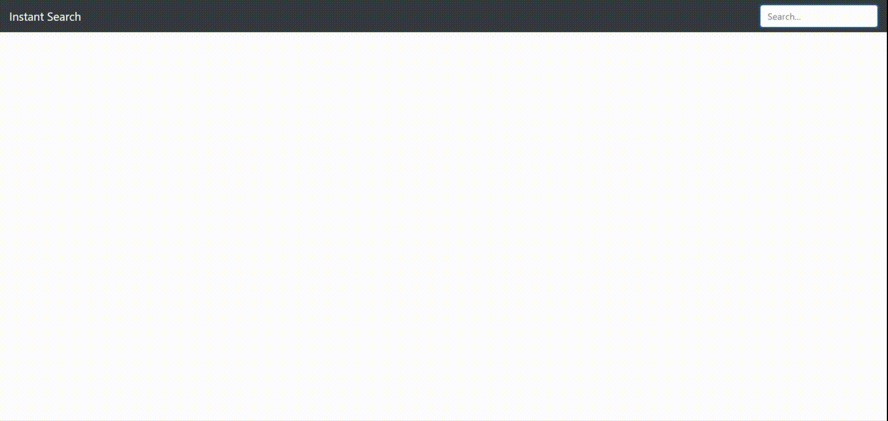

# React Live Search Using Pixbay API 

:fire: This is a workshop for learning how to build React Applications.

## : Preview

## How To Start
You can Manually Download From : `Clone or Download`.
Clone this Repo to Your Local Repository: `git clone <---->`. From there on you should be good.
Navigate in to Repo: `Using CD <Folder name or Path>`.
Run `npm install`.
Run : `npm start`.

## Repository Description:
Live Search in react application

## Useful Links
1. [Reference Link](https://codeytek.com/live-search-search-react-live-search-in-react-axios-autocomplete-pagination/)
2. [Pixabay API](https://pixabay.com/api/docs/#api_search_images)

